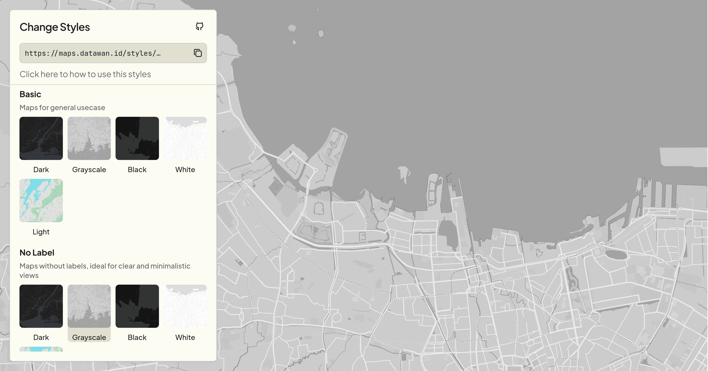
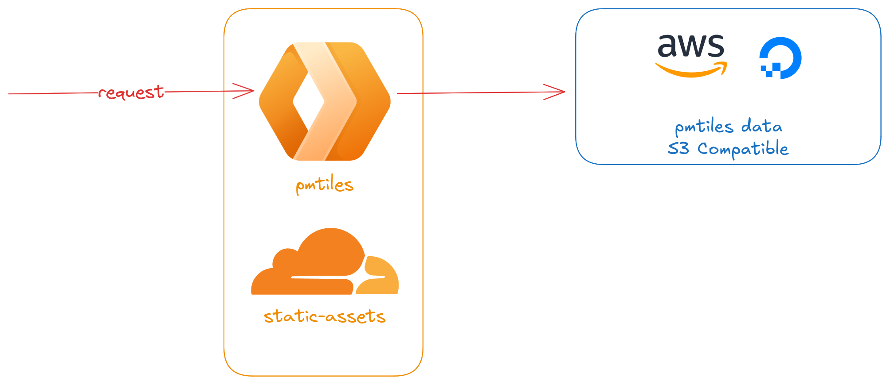
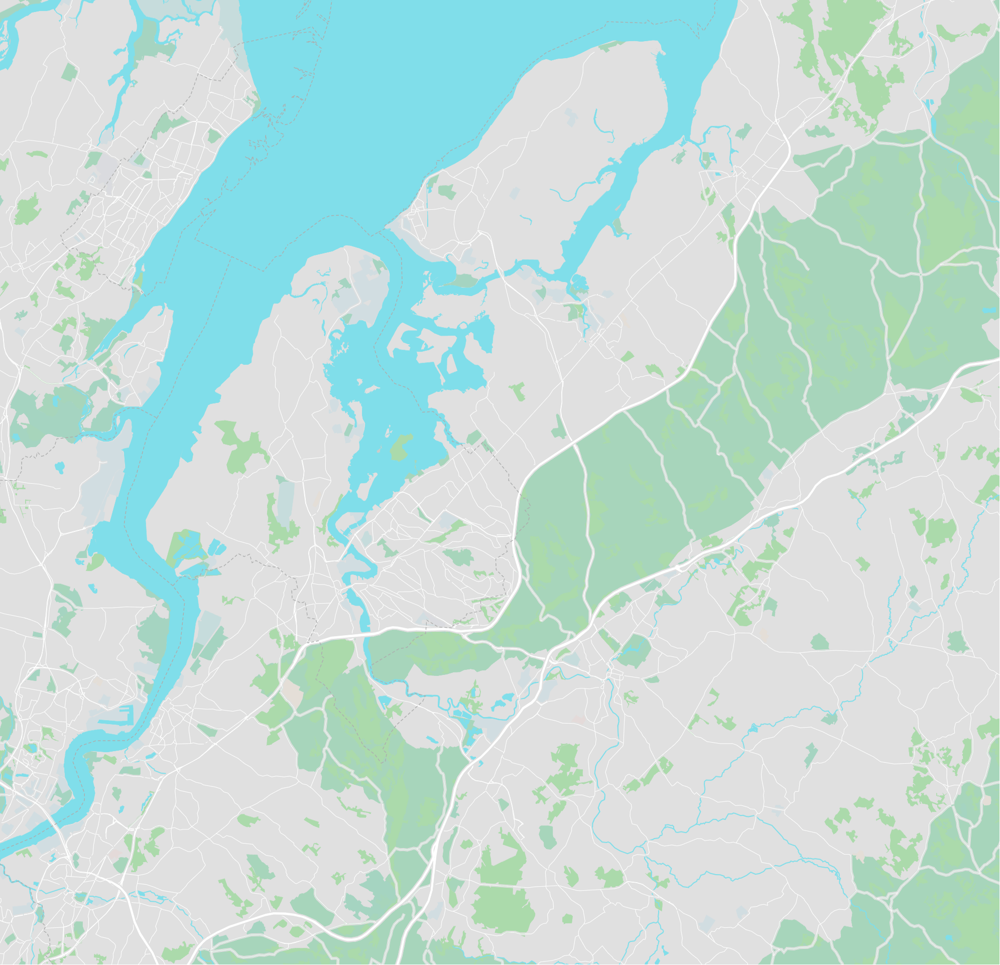
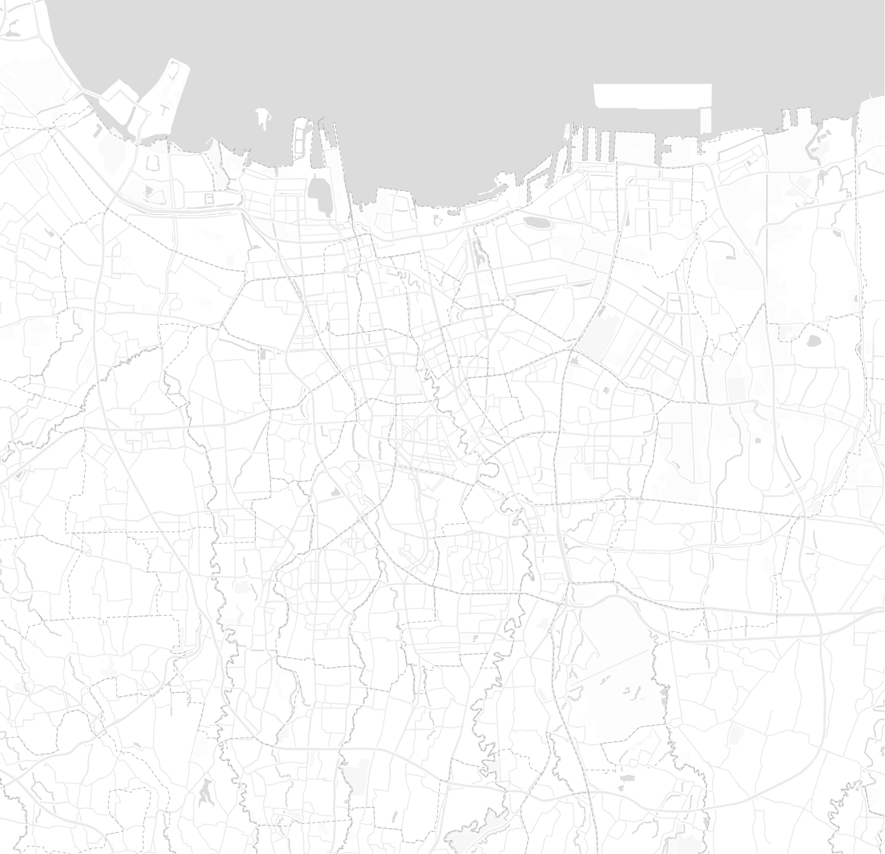
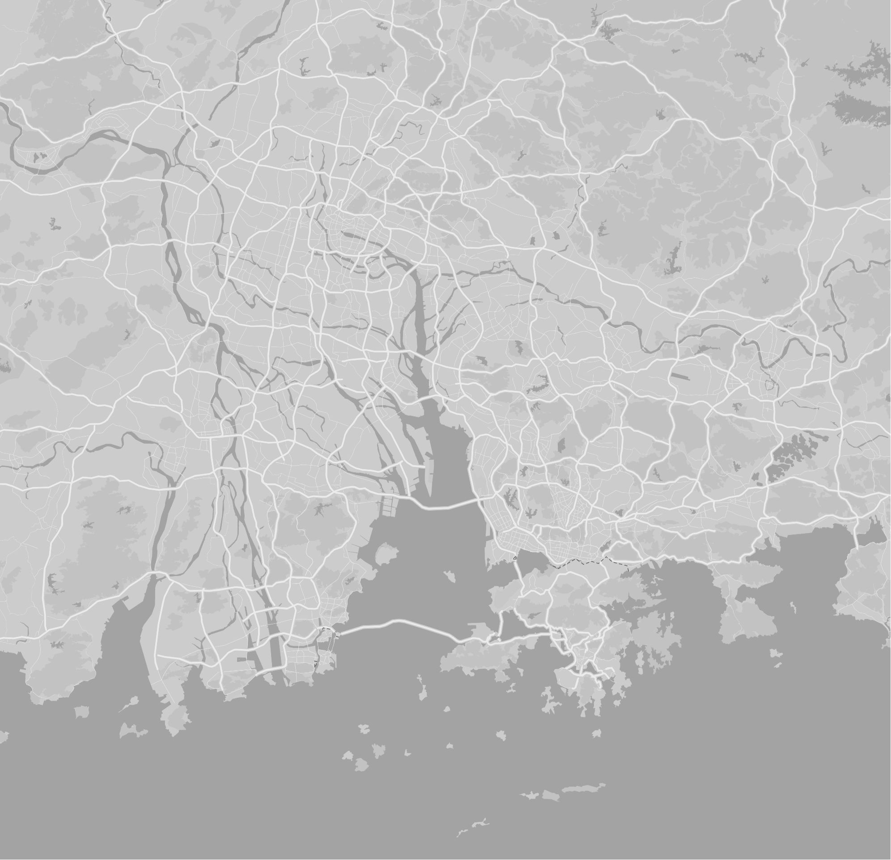
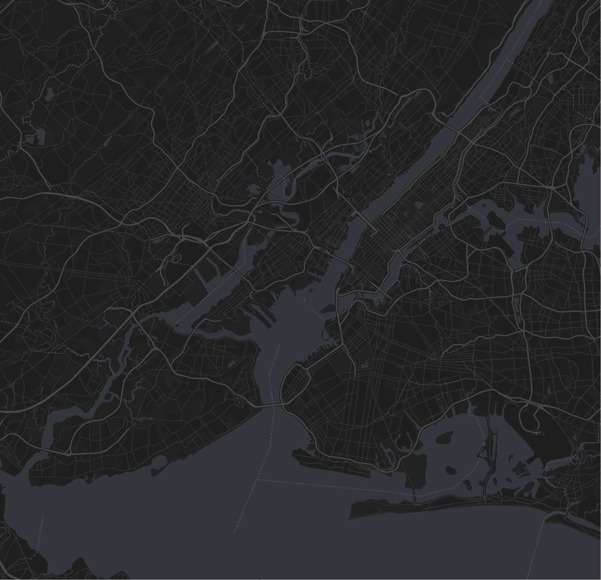
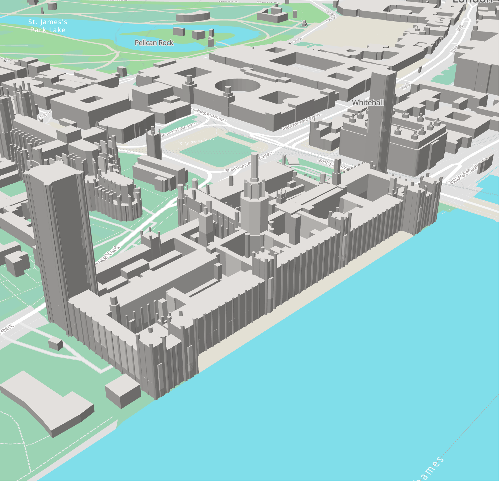
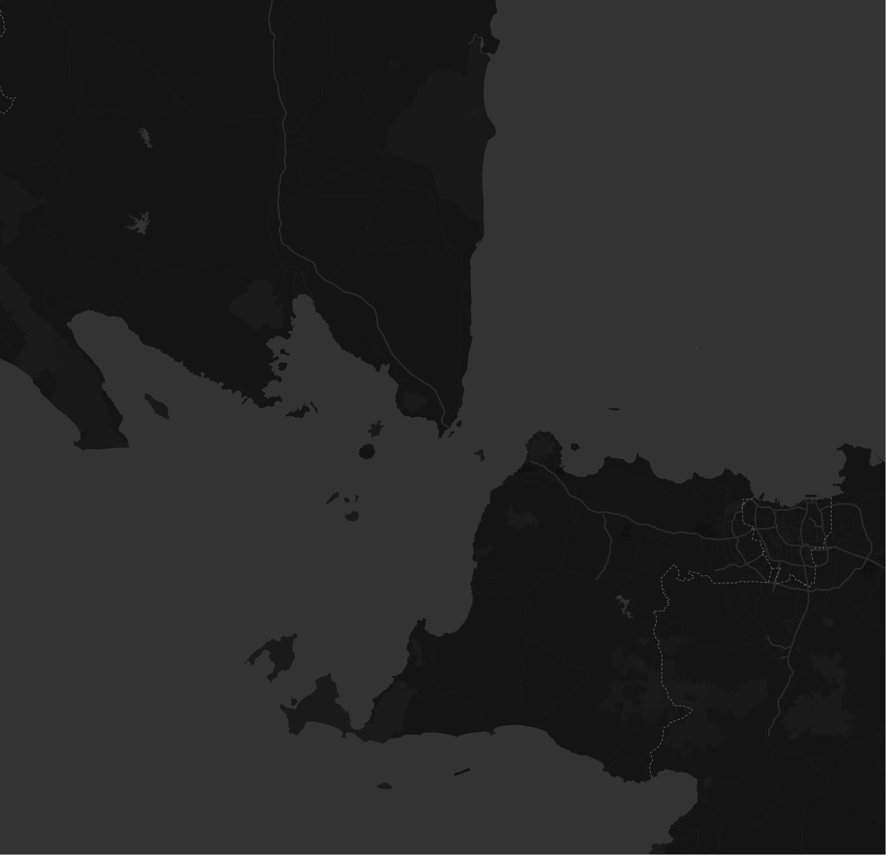

# Datawan Maps



This project provides a collection of full planet vector basemap styles designed for use with [Maplibre-GL](https://maplibre.org/) and [Mapbox-GL](https://docs.mapbox.com/mapbox-gl-js/guides/). All styles are based on OpenStreetMap data with [Tilezen](https://tilezen.readthedocs.io/en/latest/layers/) vector tiles and are deployed with [PMTiles](https://github.com/protomaps/PMTiles). These styles are **free to use for non-commercial projects**.

## Deployment & Stack

To deploy styles, you first need to set up your PMTiles. Follow the [official documentation](https://docs.protomaps.com/guide/getting-started) to get start. In this project, PMTiles data is stored in S3-compatible storage, such as AWS S3, DigitalOcean Spaces, Cloudflare R2, or similar services. Static assets, such as glyphs, styles, and sprites, also for landing page, are deployed using a Cloudflare Worker with [static assets](https://developers.cloudflare.com/workers/static-assets/routing/), alongside the main worker, which transforms XYZ URLs to tile requests by accessing PMTiles data from S3 storage. This setup allows us to cache non-tile URLs as static assets, and optimize XYZ URL requests to minimize sub-requests to S3.



To deploy, you need to set the following environment variables in cloudflare config:

| Variable            | Type   | Description                                 |
| ------------------- | ------ | ------------------------------------------- |
| `BUCKET`            | string | Name of your S3 Buckets                     |
| `ACCESS_KEY_ID`     | string | Access key ID for your storage provider     |
| `SECRET_ACCESS_KEY` | string | Secret access key for your storage provider |

> If you want to self host your styles, make sure you change all source url in [all styles](./maps/styles/) to your urls.

## Styles

We provide 11 styles, and all styles based on [protomaps basemaps](https://github.com/protomaps/basemaps), including glyphs and sprites.

- Light
- Dark
- Black
- White
- Grayscale
- Light No Label
- Dark No Label
- Black No Label
- White No Label
- Grayscale No Label
- Light 3D
- _(soon...)_

|                                        |                                        |                                                |
| -------------------------------------- | -------------------------------------- | ---------------------------------------------- |
|  |  |  |
|    |  |          |

## Attribution

You must add attribution if you use any of these styles. At least, include OpenStreetMap contributors, or full attribution

```html
<a href="https://datawan.id">Datawan</a> | <a href="https://github.com/protomaps/basemaps">Protomaps</a> © <a href="https://openstreetmap.org">OpenStreetMap</a>
```
